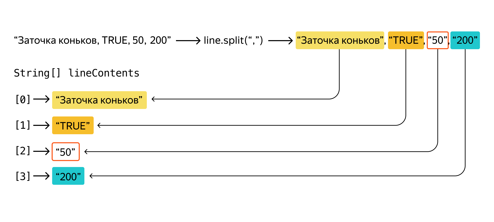
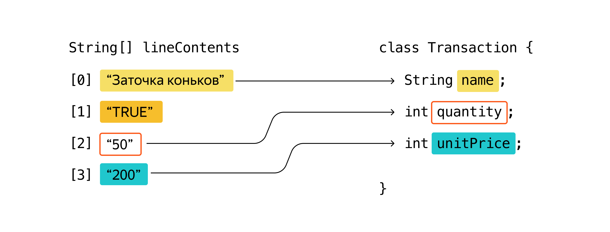

# Техническое задание

## Цель — написать приложение для бухгалтерии

Представьте ситуацию — отдел бухгалтерии парка аттракционов для ведения бюджета пользуется простыми excel-таблицами. При
вводе данных и подсчёте баланса постоянно возникают ошибки. Вам нужно создать приложение, которое упростит работу
бухгалтерии и снизит число ошибок в расчётах.

Нужно реализовать в приложении такую функциональность:

1. Консольный интерфейс для управления программой.
2. Считывание месячных и годового отчётов бухгалтерии из файлов и их перевод в объекты приложения.
3. Сверка данных по месячным и годовому отчётам.
4. Вывод информации о месячных и годовом отчётах.

Для разработки приложения бухгалтерия готова предоставить три месячных отчёта: за январь, февраль и март 2021 года, а
также частичный годовой отчёт за эти же три месяца. Пока достаточно, чтобы приложение обрабатывало только эти данные.

### Стартовые вводные

### Формат входных файлов

Бухгалтерия готова предоставить данные о своей деятельности в виде файлов в формате **CSV — Comma-Separated Values** (
англ.
«значения, разделённые запятыми»). Каждый файл в формате CSV состоит из набора строк. В первой строке идут заголовки
столбцов. Каждая следующая строка состоит из значений, разделённых символом-разделителем — запятой.

Можно представить формат CSV как таблицу, но такую, как если бы все лишние пробелы и выравнивания в ней удалили. К
примеру, таблица в текстовом редакторе, написанная для того, чтобы её удобно было читать человеку, будет выглядеть так.

```
item                 | price | available_by_delivery
Полотенце            | 200   | TRUE
Холодильник          | 10000 | FALSE
Чайник электрический | 900   | TRUE
Тостер               | 1000  | TRUE
Духовка              | 7500  | FALSE
```

А вот программе такой формат читать неудобно — нужно дополнительно отсекать пробелы. При этом в случае со строковыми
данными пробел может быть важной частью значения в ячейке. Поэтому тут пригодится формат CSV. Вот как выглядят в нём
данные.

```
item,price,available_by_delivery
Полотенце,200,TRUE
Холодильник,10000,FALSE
Чайник электрический,900,TRUE
Тостер,1000,TRUE
Духовка,7500,FALSE
```

Теперь программе достаточно «разрезать» строку по разделителям-запятым. В результате получится массив элементов, в
котором под одинаковым индексом всегда будет объект из соответствующей колонки. Например, в каждой строке элемент под
индексом [1] будет соответствовать цене.

Приложение должно работать с двумя видами файлов-отчётов — месячными и годовым. Нужно будет разбить входящий файл на
составляющие и преобразовать к объектам приложения. Разберём подробнее, как они будут представлены.

### Месячный отчёт

Месячный отчёт содержит данные о доходах и расходах в рамках одного календарного месяца.

- Имена месячных отчётов.
  Файлы с отчётами именуются определённым образом, чтобы упростить их считывание и обработку. Имена файлов с месячными
  отчётами имеют формат `m.YYYYMM.csv`, где:
    - `m` — буква m в начале файла, чтобы отделить отчёты за месяц и отчёты за год;
    - `YYYY` — год. Например, 2021;
    - `MM` — месяц строго двумя цифрами. Счёт начинается с единицы, то есть 01 — «январь», а 11 — «ноябрь».
      Примеры: `m.202001.csv` — месячный отчёт за январь 2020 года, `m.201912.csv` — месячный отчёт за декабрь 2019
      года.
- Пример CSV-файла с месячным отчётом.
  ```
  item_name,is_expense,quantity,unit_price
  Воздушные шарики,TRUE,5000,5
  Автоматы с мороженым,TRUE,12,15000
  Продажа мороженого,FALSE,1000,120
  ```
  У каждой строки месячного отчёта — четыре поля:
    1. `item_name` — название товара;
    2. `is_expense` — одно из двух значений: `TRUE` или `FALSE`. Обозначает, является ли запись тратой (`TRUE`) или
       доходом (`FALSE`);
    3. `quantity` — количество закупленного или проданного товара;
    4. `unit_price` — стоимость одной единицы товара. Целое число.
    5. Класс месячного отчёта — `MonthlyReport`.

### Годовой отчёт

Годовой отчёт содержит информацию обо всех тратах в течение года. На каждый месяц по две записи — общий доход и расход
за этот месяц.

- Имя годового отчёта.
  Имя файла с годовым отчётом имеет формат `y.YYYY.csv`, где:
    - `y` — буква `y` в начале файла, чтобы отделить отчёты за месяц и отчёты за год;
    - `YYYY` — год, например 2021.
      Примеры: `y.2020.csv` — годовой отчёт за 2020 год, `y.2018.csv` — годовой отчёт за 2018 год.
- Пример CSV файла с годовым отчётом.
  ```
  month,amount,is_expense
  01,100000,false
  01,30000,true
  02,321690,false
  02,130000,true
  03,999999,true
  03,999999,false
  ```
  Строка годового отчёта состоит из трёх полей:
    1. `month` — месяц, целое число, обозначается строго двумя цифрами, начиная с единицы, то есть 01 — «январь», а 11 —
       «ноябрь»;
    2. `amount` — сумма;
    3. `is_expense` — одно из двух значений: `true` или `false`. Обозначает, является ли запись тратой (true) или
       доходом (false).
- В приложении представлен классом `YearlyReport`.

### Как проектировать решение

Особенность создания любого IT-продукта — эксклюзивность его разработки. В обратном случае процесс написания программ
уже давно был бы автоматизирован. Однако разработка любого программного продукта начинается с проектирования решения.

Прочитайте внимательно требования к проекту. Затем продумайте, какие классы могут использоваться в решении. Для каждого
класса опишите его данные и методы, работающие с этими данными.

Этап проектирования также включает обращение к уже изученному материалу (не полагайтесь на свою память — это ненадёжный
источник). Воспользуйтесь поиском на платформе. Проект задуман из расчёта, что вы сможете его выполнить на основе
пройденных тем.

### Технические требования

Переходим к требованиям. В начале ТЗ мы уже обозначили, что приложение должно иметь консольный интерфейс, считывать
месячные и годовой отчёты бухгалтерии из файлов и переводить их в объекты приложения, сверять данные отчётов, а также
выводить о них информацию. Теперь разберём требования к каждой функциональности подробнее.

### 1. Консольный интерфейс

Консольный интерфейс приложения должен предлагать пользователю выбор из пяти действий:

- Считать все месячные отчёты — прочитать данные из файлов месячных отчётов, сохранить их в память программы.
  ```
  💡 При выборе действия «считать все месячные отчёты» должно происходить считывание трёх файлов:
  m.202101.csv
  m.202102.csv
  m.202103.csv
  ```
- Считать все месячные отчёты — прочитать данные из файлов месячных отчётов, сохранить их в память программы.
  ```
  💡 При выборе действия «считать годовой отчёт» должно происходить считывание из одного файла:
  y.2021.csv
  ```
    - Сверить отчёты — по сохранённым данным проверить, сходятся ли отчёты за месяцы и за год.
    - Вывести информацию обо всех месячных отчётах — по сохранённым данным вывести в консоль имеющуюся информацию.
    - Вывести информацию о годовом отчёте — по сохранённым данным вывести в консоль имеющуюся информацию.

После того как действие выбрано и выполнено, программа должна позволять оператору выбрать следующее действие.
Работа программы должна завершаться только при вводе оператором специальной последовательности символов. Вам нужно
придумать такую последовательность самостоятельно.

### 2. Считывание файлов

Содержимое файлов должно приводиться к объектам приложения для дальнейшей обработки.

### 3. Сверка данных

Сверка данных — это проверка, что данные в двух и более разных источниках не противоречат друг другу. Вам нужно
проверить, что информация в годовом отчёте не противоречит информации в месячных отчётах.
Для сверки данных программа должна делать следующее:

1. Проверить, что месячные и годовой отчёты были считаны из файлов. В случае если этого не было сделано, нужно
   предложить сначала считать данные.
2. Подсчитать суммы доходов и расходов по каждому из месяцев.
3. Сверить полученные суммы с суммой доходов и расходов в отчёте по году.
4. При обнаружении несоответствия программа должна вывести месяц, где оно обнаружено.
5. Если несоответствий не обнаружено, приложение должно вывести только информацию об успешном завершении операции.

### 4. Вывод информации

Программа должна поддерживать вывод информации из месячных и годового отчёта.

- Информация из месячных отчётов.
  При вызове этой функции программа должна выводить следующие данные по каждому из месяцев:
    1. название месяца;
    2. самый прибыльный товар, название товара и сумму;
    3. самую большую трату, название товара и сумму.

  🔥 Перед выполнением подсчётов необходимо проверить, что месячные отчёты были считаны из файла. В случае если этого
  сделано не было, нужно предложить сначала считать данные.
- Информация из годового отчёта.
  При вызове этой функции программа должна выводить такие данные:
    1. рассматриваемый год;
    2. прибыль по каждому месяцу; (Прибыль будем понимать как разницу доходов и расходов, может быть отрицательной.)
    3. средний расход за все имеющиеся операции в году;
    4. средний доход за все имеющиеся операции в году.

  🔥 Перед выполнением подсчётов необходимо проверить, что годовой отчёт был считан из файла. В случае если этого сделано
  не было, нужно предложить сначала считать данные.

### Детали реализации

Чтобы упростить для вас работу над приложением, мы решили чуть подробнее остановиться на некоторых технических моментах
реализации программы.

### Как считать выбор пользователя

Для считывания команд от пользователя снова понадобится класс `Scanner`. Создайте бесконечный цикл, выход из которого
происходит только при вводе определённого символа или числа. Предусмотрите меню, чтобы пользователь мог выбрать нужную
ему опцию.

Не забудьте обработать случай, когда пользователь вводит команду, не предусмотренную приложением, а также опцию для
завершения работы.

```java
Scanner scanner = new Scanner(System.in);

while (true) {
    // Вывод доступных пунктов меню в консоль
    int userInput = scanner.nextInt();
    // Вызов соответствующего метода в зависимости от userInput
}
```

### Работа с CSV-строкой

При работе со строками известного формата удобно пользоваться методом `split(String regex)`. Этот метод делит исходную
строку по символу-разделителю и возвращает массив строк. Например, чтобы разбить строку из файла месячного отчёта, нужно
вызвать метод с аргументом «,».

```java
String[] lineContents = line.split(",");
```

Когда строка разбита на отдельные элементы, можно обращаться к конкретным значениям внутри неё. Например, к значениям
месяц `month` или сумма `amount`. В файле с годовой отчётностью это 1-й и 2-й столбец соответственно. Номер месяца будет
храниться в массиве `lineContents` под индексом `0`, а сумма — под индексом `1`.



🔥 Обратите внимание, CSV-файл начинается со строки-заголовка, которую необязательно анализировать, — вам нужны именно
значения. Поэтому цикл по всем строкам из файла начинайте с `1`, а не с `0`.

Однако ориентироваться по номерам элементов неудобно. Например, если дальше в коде понадобится количество товара, нужно
будет сначала вспомнить, в каком элементе массива оно находится. Если таких обращений будет несколько — возрастает
сложность кода и вероятность ошибки.

Гораздо эффективнее полученный массив хранить в экземпляре отдельного класса, где каждому полю соответствует конкретное
значение из таблицы. Например, элемент `lineContents[0]`, который соответствует названию, поместить в поле `name` класса
`Transaction`. Аналогично и с другими необходимыми значениями.



### Несколько полезных советов

- **Как работать с файлами месяцев**
  Так как месяцев несколько, обрабатывать месячные отчёты можно в цикле. По заданию вам даётся формат данных. Вы можете
  преобразовать счётчик цикла `i` и несколько строковых констант в имя файла, например `"m.20210" + i + ".csv"`.
- **Как организовать методы так, чтобы с ними было удобно работать**
  Для удобства можно создать дополнительные методы в классах отчётов `MonthlyReport` и `YearlyReport`, которые будут
  возвращать максимальные, минимальные и средние суммы по доходам и расходам.

  Перед сверкой не забудьте проверить, что пользователь уже вызвал методы по считыванию обоих видов отчётов. Для этого
  можно проверить значение отчётов на `null` либо завести дополнительную приватную `boolean`-переменную.
- **Как определить самый прибыльный товар**
  Самый прибыльный товар — это товар, для которого `is_expense == false`, а произведение количества (`quantity`) на
  сумму (
  `unit_price`) максимально.
- **Как упростить код и допустить меньше ошибок**
  Считывание данных и их обработка — это не связанные между собой операции. Разделение подобных функций на разные
  классы — один из способов упрощения программ. Метод по печати отчёта не должен задумываться о том, в каком отчёте
  данные хранятся в файлах. Точно так же метод по считыванию данных должен только их считывать, возможно, с минимальной
  обработкой, но не должен автоматически вычислять, к примеру, самый прибыльный товар.
- **Что может пойти не так**
  Для каждой команды сверки и вывода информации о месячных и годовом отчёте необходимо проверить, что соответствующие
  данные из файлов были считаны. В случае если этого сделано не было, нужно предложить сначала считать эти данные.
